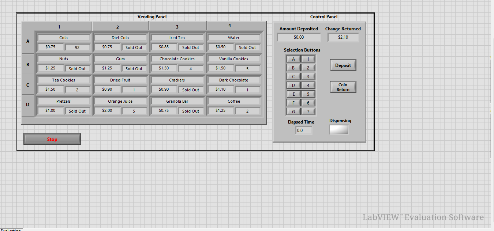

# Vending Machine — LabVIEW

A simulated Vending Machine implemented in NI LabVIEW with a front-panel UI. The program demonstrates coin insertion, product selection, balance management, dispensing, and refunds using a simple state-machine architecture.

---

## 🔹 Project Overview

This project models the behavior of an electronic vending machine in LabVIEW. Users can insert coins, select products, view the real-time balance, dispense items when sufficient funds are available, and request refunds or reset the machine for the next customer.

---

## 🎯 Objective

Design and implement a LabVIEW application that mimics an electronic vending machine and demonstrates:

- Sequential decision making
- User input handling
- Embedded/control-system concepts in LabVIEW

---

## ✨ Features

- Coin input simulation (₹1 / ₹2 / ₹5 / ₹10)
- Multiple product buttons with preset prices
- Real-time balance display
- “Dispense Item” indicator
- Refund option for excess balance
- Reset system for the next customer

---

## 🧩 Architecture & Concepts Used

- While Loop with Shift Registers to store and persist balance across iterations
- Case Structures representing machine states
- Arrays for product price mapping and lookup
- Comparison logic to verify sufficient balance
- Simple event/polling mechanism for front-panel UI controls

State flow:
- Idle
- Insert Coin
- Select Product
- Check Balance
- Dispense / Refund
- Reset

---

## 🚀 How to Run

1. Open `VendingMachine.vi` in LabVIEW (LabVIEW 2020 or later recommended).  
2. Click the Run arrow in LabVIEW.  
3. Click coin buttons to add balance (₹1, ₹2, ₹5, ₹10).  
4. Select a product button. The system checks the price and either dispenses the item or shows an insufficient balance message.  
5. Use the `Refund` button to return excess balance.  
6. Press `Reset` to start a new transaction.

---

## 📂 Files Included

- `VendingMachine.vi` — Main VI (front panel and block diagram)  
- `Price_Config.ctl` (optional) — Custom control for product prices  
- `SubVIs/` — Helper VIs for balance check, dispensing logic, and initialization  
- `images/image_1.png` — Front-panel screenshot (included)

---

## 🛠 Requirements

- LabVIEW 2020 or later  
- Windows OS  
- NI Runtime (only required if running a built EXE)

---

## 📚 Learning Outcomes

- LabVIEW front-panel (UI) design and event handling  
- Implementing a state machine with shift registers and case structures  
- Data persistence and transactional logic  
- Simple financial logic (balance calculation, refund handling)  
- Error handling and user guidance on the UI

---

## 🔮 Future Enhancements

- Track product inventory and decrement on dispense  
- Auto-refund timeout if no action after selection  
- Touch-screen optimized UI  
- Hardware integration (e.g., Arduino, CAN bus) for real dispensing mechanisms

---

## 📸 Screenshot

Front-panel screenshot included:

(If the image doesn't display, ensure `images/image_1.png` exists in the repository and the path is correct.)

---

## 📢 Conclusion

This project demonstrates how LabVIEW can be used to build control-oriented, transactional applications that mirror real-world systems. It's a practical exercise in state machines, user I/O handling, and simple embedded-control principles.

---

Developed by: Jenna — Embedded enthusiast (jenna2004jna)
